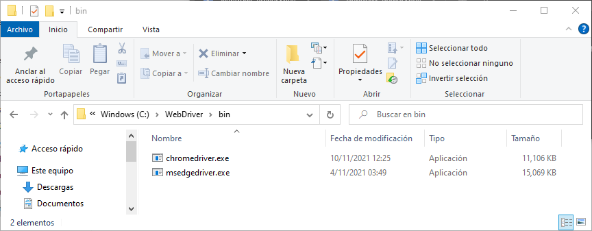

# Laboratorio 05: Pruebas funcionales con Selenium Web

El presente laboratorio consiste en la automatización de pruebas funcionales con Selenium Web Driver para la aplicación de Percentage-Calculator.

<https://www.calculator.net/percent-calculator.html>

## Pre - requisitos

1. Navegador Chrome
2. Selenium Web Driver for Chrome
3. Node.JS para JavaScript
4. NPM
5. Git

## Actividades

1. Implementar Casos de prueba para la funcionalidad "Percentage Calculator"

    * Diseñar casos de prueba: Entradas, proceso, Resultado Esperado
    * Implementar los scripts de prueba
    
    

    * Ejecutar los scripts de prueba
    
    

    * Reportar los resultados de la ejecución

    

2. Configurar Browser-specific WebDriver 

    * Descarga de Selenium Driver Web for Chrome de la página <https://chromedriver.storage.googleapis.com/index.html>

    

    * Descomprimir en una carpeta para luego agregar al PATH del sistema en Windows.

    

    * Agregar el directorio al PATH del sistema

        > `setx PATH "%PATH%;C:\WebDriver\bin"`

    